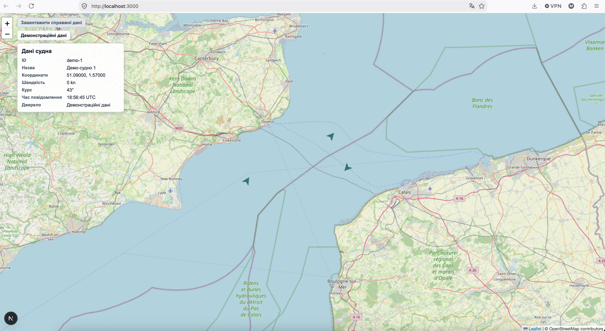

# SeaRadar

SeaRadar — локальний навчальний R1-зріз для карти Дуврської протоки та демонстраційних суден. Проєкт показує три demo-судна на Leaflet/OSM-карті, відкриває картку вибраного судна, рухає судна літеральними маршрутами та перевіряє базову взаємодію браузерним тестом Playwright.

## Поточний стан

- **Sprint 1 / R1:** `DONE` / `Verified`.
- **Runtime baseline:** Node.js `22.x`.
- **Доставка:** commit [`e98145e`](https://github.com/RomanMakarenko/SeaRadar/commit/e98145e), branch `sprint1`, синхронізований з `origin/sprint1`.
- **Наступні спринти:** Sprint 2 і Sprint 3 не деталізовані та не авторизовані.
- **Продуктовий scope:** тільки локальна демонстраційна карта; AIS/API, пошук, pause, rewind, loop і production deployment не входять до R1.

## Візуальний результат



На зображенні зафіксовані карта Дуврської протоки, три demo-маркери, картка `demo-1`, керування картою та attribution OpenStreetMap. Файл є локальним delivery-артефактом: `sea-radar-s1.png`.

## Що зроблено в Sprint 1

- **B-01 — каркас:** Next.js App Router, React, TypeScript strict, локальний запуск і lock-файл.
- **B-02 — карта:** Leaflet лише на клієнті, OSM Standard, attribution, межі та початковий вид району.
- **B-03 — модель судна:** типізована модель, курс/нейтральний значок і підпис джерела.
- **B-04 — вибір і картка:** вибір судна за ідентифікатором, форматування координат/швидкості/курсу/часу, повторний клік не закриває картку.
- **B-05 — demo-маршрути:** `demo-1`, `demo-2`, `demo-3`, по десять літеральних точок маршруту та задані швидкості.
- **B-06 — рух:** один lifecycle-scoped timer з інтервалом `2000 ms`, перехід на наступну точку, курс поточного сегмента, оновлення вибраної картки та зупинка на останній точці зі швидкістю `0 kn`.
- **B-07 — браузерна перевірка:** один Playwright Test runner/project на Chromium, matching marker/card selection, persistence повторного кліку та блокування OSM tile requests.

## Як виконували роботу

Робота велася як послідовність bounded slices, а не як один великий невідокремлений rewrite:

1. Спочатку читали governance baseline, `SPEC.md`, поточний Sprint і останній handoff.
2. Перед кожною зміною оновлювали `TASK_SPEC.md`: goal, allowed paths, non-goals, acceptance, checks, stop conditions і rollback.
3. Реалізовували один backlog slice за раз — B-01 → B-07 — без майбутніх AIS/API або S2/S3 заготовок.
4. Після зміни виконували перевірки у порядку `check → validate → build → targeted tests`.
5. Результати записували лише після фактичного запуску: `EVIDENCE.md` — для спостережених фактів, `RUNBOOK.md` — для delivery history та handoff.
6. Перед delivery проводили human diff review, явно фіксували `continue`, після чого робили bounded commit і push.
7. Зміну runtime baseline з Node.js 24 на Node.js 22 оформили окремим decision record `DEC-005-R1-NODE22`; Node.js 24 локально видалили через nvm.
8. Остаточне приймання Sprint 1 підтверджене product owner і записане в `E-SEA-027`.

## Запуск

Потрібні Node.js `22.x` і npm.

```bash
npm install
npm run dev
```

Застосунок доступний на loopback-адресі:

```text
http://127.0.0.1:3000
```

Карта використовує OpenStreetMap Standard tile URL і attribution. Для повного візуального результату потрібне мережеве завантаження тайлів; браузерний selection test навмисно блокує OSM tiles, щоб не залежати від мережі.

## Перевірки

Основні команди R1:

```bash
node --version
npm --version
git diff --check
npx tsc --noEmit
npm run build
npm ls --depth=0
npx playwright test tests/vessel-selection.spec.ts
```

Останній підтверджений runtime check на Node.js 22:

- Node.js `v22.23.2`, npm `10.9.8`;
- `npx tsc --noEmit` — `PASS`;
- `npm run build` — `PASS`;
- targeted Playwright — `1 passed` під одним Chromium project;
- dev server, використаний Playwright, також працював через Node.js `v22.23.2`.

Chromium можна встановити окремо, якщо його немає локально:

```bash
npx playwright install chromium
```

## Карта артефактів

Канонічні артефакти лежать у корені репозиторію, якщо не вказано інше:

```text
SeaRadar/
├── CLAUDE.md                         # governance, правила scope, acceptance і rollback
├── README.md                         # цей entry point: запуск, спосіб роботи й карта артефактів
├── PROJECT_BRIEF.md                  # вихідний product brief і межі MVP
├── SPEC.md                           # versioned project contract: проблема, user/JTBD, scope і acceptance
├── SPRINT-01.md                      # єдиний деталізований план R1; B-01…B-07 і closure
├── TASK_SPEC.md                      # contract поточного bounded task / останнього delivery slice
├── EVIDENCE.md                       # append-only ledger фактичних перевірок та їхніх limitations
├── RUNBOOK.md                        # append-only delivery history, decisions, blockers і handoff
├── ABOUT.md                          # короткий опис і вимоги для повторного запуску
├── package.json                      # scripts, dependencies і Node.js 22.x engine
├── package-lock.json                 # зафіксований npm dependency graph
├── playwright.config.ts              # один Chromium project і автоматичний dev server
├── tests/
│   └── vessel-selection.spec.ts      # B-07 selection/card/tile-block test
├── app/
│   ├── page.tsx                      # page entry
│   ├── layout.tsx                    # root layout і глобальні стилі
│   ├── map-shell.tsx                 # selected-vessel state і UI shell
│   ├── sea-map.tsx                   # client-only Leaflet map і B-06 motion lifecycle
│   ├── vessel-model.ts               # Vessel/DemoVessel типи та literal routes
│   ├── vessel-card.tsx               # форматування картки судна
│   ├── map-config.ts                 # center, bounds, zoom і OSM layer config
│   └── globals.css                   # layout, card і marker styles
├── docs/
│   └── decisions/
│       ├── README.md                 # convention та каталог decision records
│       ├── DEC-001-mvp-contract.md   # MVP contract decision
│       ├── DEC-002-r1-stack.md       # історичний Node.js 24 stack record, Superseded
│       ├── DEC-003-r1-handoff.md     # handoff convention
│       ├── DEC-004-checkpoint-convention.md # checkpoint convention
│       └── DEC-005-r1-node22.md       # поточний Node.js 22 baseline
├── EVIDENCE.md                       # canonical evidence path; не створювати дублікати
├── RUNBOOK.md                        # canonical delivery history path
├── sea-radar-s1.png                  # screenshot R1, referenced above
└── .gitignore                        # Node/Next/Playwright generated output rules
```

### Як читати артефакти

| Артефакт | Що в ньому ведемо | Коли оновлюємо |
|---|---|---|
| `CLAUDE.md` | operational contract і правила роботи агента | лише разом із governance-рішенням та version bump |
| `SPEC.md` | довгоживучий product contract | після погодженої зміни проблеми, scope або acceptance |
| `SPRINT-01.md` | outcome і backlog поточного R1 | після погодженого sprint-рішення або closure |
| `TASK_SPEC.md` | одна мала перевірювана робота | до Edit і при зміні task scope |
| `EVIDENCE.md` | тільки факти: source, expected, observed, status, limitations | append-only після реальної перевірки |
| `RUNBOOK.md` | delivery history, rollback, blockers і handoff | append-only після фактичного delivery/checkpoint |
| `docs/decisions/` | stack, architecture, scope та governance decisions | окремий record на material decision |
| `package.json` / lock | запуск, runtime engine і dependency graph | лише в межах схваленого task |
| `playwright.config.ts` / `tests/` | відтворюваний browser gate B-07 | разом із bounded test task |
| `sea-radar-s1.png` | візуальний reference/demo screenshot | замінювати лише окремим погодженим delivery change |

`EVIDENCE_LOG.md`, `docs/SPEC.md` та інші паралельні canonical names у цьому репозиторії не створюються без окремого decision record.

## Поточні accepted limitations

- Unmount cleanup має source/manual evidence; прямої instrumentation перевірки кожного timer/listener не додавали.
- `npm run build` зберігає попередження Next.js про зовнішній `/Users/romanmakarenko/package-lock.json`.
- `npm ls --depth=0` показує попередні extraneous `@emnapi/runtime` і `@img/sharp-wasm32`.
- B-07 перевіряє вибір судна, а не рух; рух перевірявся окремо в B-06 manual/hot-reload checks.
- Реальні AIS дані, API, authentication, deployment і production readiness не є частиною R1.

Ці limitations прийняті для закриття Sprint 1 у `E-SEA-027`; вони не розширюють scope і не авторизують Sprint 2 або Sprint 3.

## Delivery і recovery

Поточний delivery commit: `e98145e`. Перед зміною наступної bounded роботи потрібно прочитати `CLAUDE.md`, `SPEC.md`, `SPRINT-01.md`, `TASK_SPEC.md`, останні записи `EVIDENCE.md` і `RUNBOOK.md`, а також перевірити `git status`.

Для аналізу delivery diff:

```bash
git show --stat e98145e
git diff e98145e^ e98145e --name-only
```

Не робіть `git reset --hard` для recovery без окремої авторизації. Відновлення має повертатися до останнього підтвердженого commit і зберігати append-only history та pre-existing untracked inputs.
