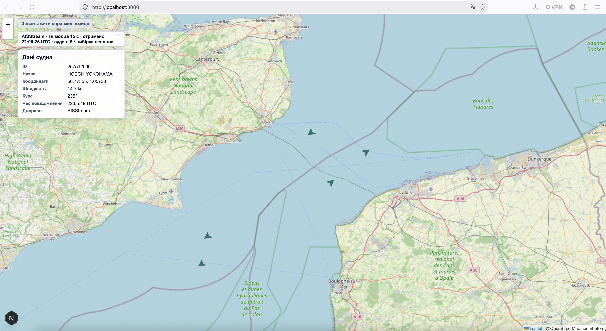

# Sprint 2 — робота, перевірки та обмеження

- **ID:** `SPRINT-SEA-R2-RETROSPECTIVE-001`
  - **Version:** `1.1.0`
- **Status:** `Verified` — ретроспективний документ переглянуто й прийнято.
- **Owner:** виконавець проєкту; продуктовий owner — методист відділення теорії судноводіння навчального центру «Норд-Вест».
- **Date:** 2026-09-28
- **Related artifacts:** [`SPRINT-02.md`](SPRINT-02.md), [`SPEC.md`](SPEC.md), [`TASK_SPEC.md`](TASK_SPEC.md), [`EVIDENCE.md`](EVIDENCE.md), [`RUNBOOK.md`](RUNBOOK.md), [`DEC-006`](docs/decisions/DEC-006-r2-scope.md), [`DEC-009`](docs/decisions/DEC-009-r2-current-task-status.md), [`DEC-010`](docs/decisions/DEC-010-r2-sparse-snapshot-demo-fallback.md), [`CHECKPOINT-22`](docs/checkpoints/CHECKPOINT-22.md), [`CHECKPOINT-23`](docs/checkpoints/CHECKPOINT-23.md), [`CHECKPOINT-24`](docs/checkpoints/CHECKPOINT-24.md), [`CHECKPOINT-25`](docs/checkpoints/CHECKPOINT-25.md)

> Це описовий companion до плану [`SPRINT-02.md`](SPRINT-02.md), а не його заміна. Фактичні команди, спостереження й обмеження залишаються в append-only [`EVIDENCE.md`](EVIDENCE.md), [`RUNBOOK.md`](RUNBOOK.md) і checkpoint-записах. Цей README підсумовує і bounded результати, і спосіб роботи; він не є самостійним доказом виконання чи повного приймання.

## Стан коротко

- **Статус Sprint 2 / R2:** `ЗАВЕРШЕНО` в межах погодженого bounded scope — `PASS / VERIFIED` для US-05…US-08, B-08…B-14 і визначених критеріїв CHECKPOINT-03; див. [`CHECKPOINT-25`](docs/checkpoints/CHECKPOINT-25.md). Це не повне MVP-приймання, release readiness або дозвіл на deployment.
- **CHECKPOINT-03:** його початковий `HOLD / not passed` збережений як історичний стан. [`CHECKPOINT-22`](docs/checkpoints/CHECKPOINT-22.md) supersede-ить його для поточного статусу та фіксує `PASS / VERIFIED` тільки для чотирьох визначених критеріїв CHECKPOINT-03.
- **Live межа:** один обмежений LIVE-009 capture отримав server-side PositionReport, прийнятий transformer, та зберіг allowlisted sample з відповідною provenance ([`E-SEA-075`](EVIDENCE.md), [`CHECKPOINT-21`](docs/checkpoints/CHECKPOINT-21.md)). Це не доводить provider acknowledgement, чинність ключа чи повний live UI/API end-to-end шлях.
- **Типи доказів не змішуються:** локальні fixture/mock перевірки, статичні review, один bounded live capture та user-reported/screenshot-visible ручні спостереження мають різну доказову силу й описані окремо.

## Що зроблено і як це перевірялося

Таблиця підсумовує фактичні bounded slices. Посилання ведуть до evidence із командами, результатами та обмеженнями; числа тестів тут наведені за цими записами, а не перезапущені для цього README.

| Slice | Результат / метод | Evidence та межа твердження |
|---|---|---|
| **B-08 — безпечна конфігурація** | Додано server-side accessor для ключа й локальні правила доступу до secret paths; перевіряли конфігурацію, ignore/refusal boundary та missing/blank поведінку без запису значення ключа. | [`E-SEA-031`–`033`](EVIDENCE.md); не доводить чинність ключа чи доступність провайдера. |
| **B-09 — reader та endpoint** | Реалізовано bounded WebSocket reader і `GET /api/snapshot`; fake socket/events і контрольований час перевіряли lifecycle, deadline, cleanup, фіксовані помилки й no-key шлях. Перші окремо дозволені live спроби завершилися помилкою або preflight block. | [`E-SEA-034`–`035`](EVIDENCE.md), [`E-SEA-052`–`074`](EVIDENCE.md); локальні тести не є live receipt. Подальший єдиний успішний capture описаний у B-10 та `E-SEA-075`. |
| **B-10 — sample та provenance** | Спочатку створено synthetic/documentation-derived fixture з перевіреною схемою та provenance; окремим bounded LIVE-009 capture пізніше отримано transformer-accepted server-side PositionReport і збережено мінімізований allowlisted sample з matching provenance. | [`E-SEA-038`–`040`](EVIDENCE.md) — synthetic fixture; [`E-SEA-075`](EVIDENCE.md) і [`CHECKPOINT-21`](docs/checkpoints/CHECKPOINT-21.md) — єдиний bounded live capture. Локальна підписка не є provider acknowledgement; key validity лишається невідомою. |
| **B-11 — transformer** | Чисте перетворення PositionReport перевіряли fixtures: нормалізація ідентифікатора/часу, межі координат та optional speed/course, включно з відмовою для некоректних обов'язкових полів. | [`E-SEA-043`–`045`](EVIDENCE.md); 9 targeted tests, type/build checks і bounded diff review пройшли за evidence. Це не верифікація довільних live provider messages. |
| **B-12 — bounded collector** | Fake event source і контрольований час перевіряли послідовність, deadline, dedupe, ліміт 100 суден, порожній результат, помилки, cancellation та cleanup. | [`E-SEA-046`–`049`](EVIDENCE.md); 17 targeted tests і локальні checks за evidence. Підтверджено collector contract, не загальну доступність AISStream. |
| **B-13 — snapshot UI** | Mocked `GET /api/snapshot` сценарії перевіряли loading/success/empty/error, selection/card, snapshot state та відсутність stale даних. Пізніше додано regression test для переходу вибраної demo-картки в loading. | [`E-SEA-051`](EVIDENCE.md), [`E-SEA-077`](EVIDENCE.md), [`E-SEA-092`](EVIDENCE.md), [`CHECKPOINT-23`](docs/checkpoints/CHECKPOINT-23.md), [`CHECKPOINT-25`](docs/checkpoints/CHECKPOINT-25.md). 16 початкових і 17 targeted tests у пізнішому прогоні; це mock/local evidence. Ручні результати [`E-SEA-088`](EVIDENCE.md) позначені як user-reported або screenshot-visible, а не незалежна instrumentation. |
| **B-14 — рідкий snapshot та демо-маркери** | Для успішного snapshot із 0–2 AIS суднами додаються три demo-маркери; за 3+ лишаються AIS-маркери. Перевіряли межі 0–4, AIS-only count, selection та marker identity; окремо завершено bounded статичний review. | [`E-SEA-070`](EVIDENCE.md), [`E-SEA-080`](EVIDENCE.md), [`E-SEA-086`](EVIDENCE.md), [`CHECKPOINT-24`](docs/checkpoints/CHECKPOINT-24.md); 17 targeted tests, type/build checks та review за історичними evidence. CHECKPOINT-24 фіксує PASS лише для визначеного B-14 scope. |

### Підсумкова regression і bounded acceptance

Для останньої B-13 прогалини тест навмисно вибирає `demo-1`, затримує mocked `GET /api/snapshot`, перевіряє loading/disabled стан, очищення маркерів і картки, збереження підключеної карти та відсутність другого запиту при повторному кліку. Після mocked успіху застарілий demo marker/selection/card не повертається. [`E-SEA-092`](EVIDENCE.md) записує `npx playwright test tests/snapshot-interface.spec.ts` як `PASS` — 17 тестів; зовнішні OSM tile requests блокувалися тестовим helper. За цією матрицею та попередніми scoped checkpoints користувач прийняв bounded `PASS`, зафіксований у [`CHECKPOINT-25`](docs/checkpoints/CHECKPOINT-25.md).

## Як організували роботу

1. **Спочатку governance і bounded contract.** Перед кожною зміною звіряли `SPEC.md`, sprint/task контекст, актуальні записи й handoff; у `TASK_SPEC.md` фіксували мету, allowed/excluded paths, acceptance, перевірки, stop conditions і recovery. Sprint authorization не вважався автоматичним дозволом на наступну зміну чи live-запит.
2. **Один slice та одна межа за раз.** Зміни обмежували конкретними шляхами й outcome. Для реалізації, review, live-provider спроб і delivery застосовували окремі gates там, де цього вимагав task contract; людський diff review та явний `continue` не підмінялися успішним тестом.
3. **Секрети й мережа — окремо контрольовані.** Key values і raw provider payloads не записувалися в докази; live спроби мали обмеження на кількість/тривалість та stop conditions. Невдалі й заблоковані спроби зберігалися як такі. Єдиний підтверджений LIVE-009 capture не розширювався до тверджень про provider acknowledgement чи key validity.
4. **Детерміновані оракули для локальної поведінки.** Transformer/collector перевіряли fixtures, fake events і керований час; browser UI — intercepted/mock API responses, а OSM tiles блокувалися. Тести доводять лише перевірені локальні сценарії, не заміняють live evidence.
5. **Перевірка перед висновком.** Виконували targeted checks, прив'язані до конкретного contract; exact review-и читали встановлені diff/path boundaries. Тести, typecheck або build не запускали для кожного документаційного чи статичного review — статуси наведені лише там, де їх фіксують evidence.
6. **Append-only звітність і збереження історії.** `EVIDENCE.md` містить спостережені факти/обмеження; `RUNBOOK.md` — delivery chronology, blockers і handoff; checkpoints агрегують визначений scope, не переписуючи старі стани. Контрактні та фінальні рішення залишалися людськими.
7. **HOLD та невідоме не маскувалися.** Невдала live спроба не трактувалася як доказ причини; синтетичний sample не називався live. Пізніші записи можуть supersede-ити статус для поточного рішення, зберігаючи початковий checkpoint як історичний запис.

Детальні часові лінії та команди — у [RUNBOOK](RUNBOOK.md); записи evidence для R2 — у [`EVIDENCE.md`](EVIDENCE.md), зокрема [`E-SEA-031`–`E-SEA-092`](EVIDENCE.md). Scoped checkpoints: [`CHECKPOINT-21`](docs/checkpoints/CHECKPOINT-21.md) — LIVE-009; [`CHECKPOINT-22`](docs/checkpoints/CHECKPOINT-22.md) — критерії CHECKPOINT-03; [`CHECKPOINT-23`](docs/checkpoints/CHECKPOINT-23.md) — B-13 exact-commit review; [`CHECKPOINT-24`](docs/checkpoints/CHECKPOINT-24.md) — B-14 review; [`CHECKPOINT-25`](docs/checkpoints/CHECKPOINT-25.md) — bounded R2 acceptance.

## Як проходять дані до інтерфейсу

Після натискання кнопки клієнтський `MapShell` надсилає `GET /api/snapshot`. Route Handler ([`app/api/snapshot/route.ts`](app/api/snapshot/route.ts)) проходить server-side шлях через [`server/aisstream-reader.ts`](server/aisstream-reader.ts), [`server/snapshot-collector.ts`](server/snapshot-collector.ts) і [`server/position-report-transformer.ts`](server/position-report-transformer.ts); клієнт відображає snapshot на карті та у картці. Це опис реалізованої межі коду, а не твердження, що кожен UI прогін використовував live provider: Playwright UI сценарії перехоплюють endpoint і повертають fixtures.

### Візуальне свідчення

На наявному user-provided screenshot видно локальний інтерфейс з AISStream-підписом snapshot, лічильником і вибраною карткою з джерелом AISStream. Це візуальне свідчення відображеного UI стану, а не незалежний доказ того, який API-запит сформував його, live provider provenance чи повного end-to-end приймання. Окремі ручні спостереження з 2026-09-28 записані в [`E-SEA-088`](EVIDENCE.md): там розрізнено screenshot-visible факти й pass/fail результати, повідомлені користувачем.

## Підтверджене, невідоме й handoff

- **Bounded acceptance:** CHECKPOINT-25 має `PASS / VERIFIED` для US-05…US-08, B-08…B-14 і scoped CHECKPOINT-03 result. Це обмежений R2 результат, не повне MVP-приймання.
- **Live capture:** LIVE-009 підтвердив одну server-received PositionReport, прийняту transformer, і збережений мінімізований sample з matching provenance. Це не доводить provider acknowledgement, key validity, availability загалом або live UI/API end-to-end шлях.
- **Ручні спостереження:** screenshot-visible UI та повідомлені користувачем marker/card/loading/no-key результати розглядаються як окремий evidence class ([`E-SEA-088`](EVIDENCE.md)); не як незалежно instrumented trace.
- **Незафіксоване:** точна тривалість live request і no-key HTTP metadata не captured; попередній review визначив, що це не окремі canonical product acceptance criteria. No-key no-provider висновок спирається на route key guard, а не на egress instrumentation.
- **Поза висновком:** provider availability, key validity, provider acknowledgement, US-09/US-10, повне MVP-приймання, release/deployment readiness і ширша user validation не встановлені.
- **Наступний крок:** людський review цього документа та вибір `continue`, `revise` або `HOLD`. Для будь-якої подальшої технічної чи live роботи потрібен окремий bounded contract і явний дозвіл.

## Джерела

- План і вимоги: [`SPRINT-02.md`](SPRINT-02.md), [`SPEC.md`](SPEC.md).
- Bounded scope та рішення: [`DEC-006`](docs/decisions/DEC-006-r2-scope.md), [`DEC-009`](docs/decisions/DEC-009-r2-current-task-status.md), [`DEC-010`](docs/decisions/DEC-010-r2-sparse-snapshot-demo-fallback.md).
- Фактичні результати й limitations: [`EVIDENCE.md`](EVIDENCE.md), [`RUNBOOK.md`](RUNBOOK.md), зокрема `E-SEA-075`, `E-SEA-077`, `E-SEA-088`–`E-SEA-092`.
- Поточні bounded decisions: [`CHECKPOINT-22`](docs/checkpoints/CHECKPOINT-22.md), [`CHECKPOINT-23`](docs/checkpoints/CHECKPOINT-23.md), [`CHECKPOINT-24`](docs/checkpoints/CHECKPOINT-24.md), [`CHECKPOINT-25`](docs/checkpoints/CHECKPOINT-25.md).
